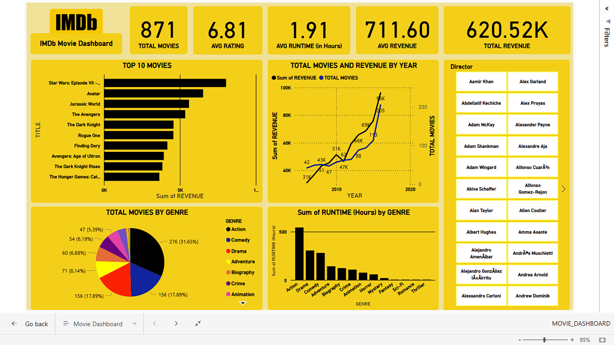
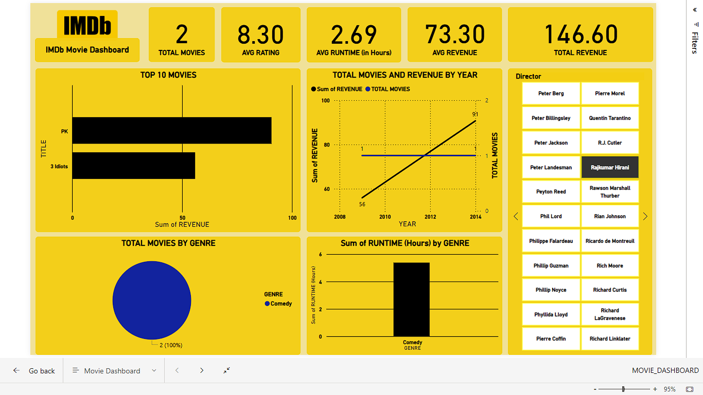
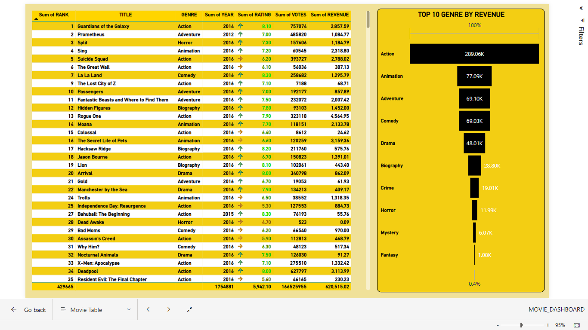
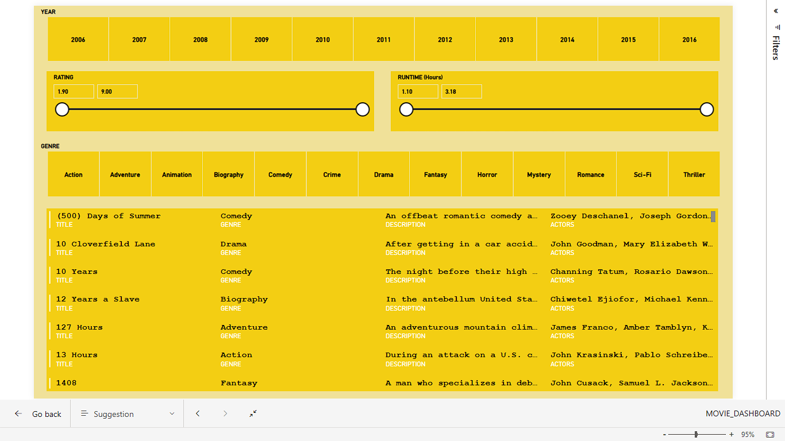

# IMDb_movie_analysis

This Power BI project analyzes trends in movie revenues, genres, and ratings. The dashboard provides insights into top-performing movie categories and yearly revenue trends.

## Tools Used
- Power BI
- DAX
- Excel (for data cleaning)

## Key Insights
- Action & Adventure genres generate the highest revenue
- IMDB rating doesn’t always correlate with revenue

## Dashboard Preview

.png)

## File
- [Movie_Dashboard.pbix](MOVIE_DASHBOARD.pbix)

@Rajkamalj9

